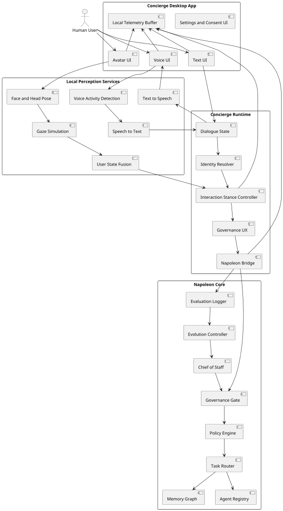
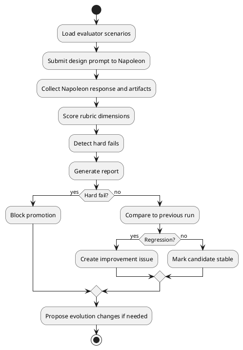
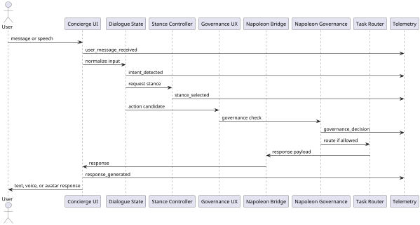
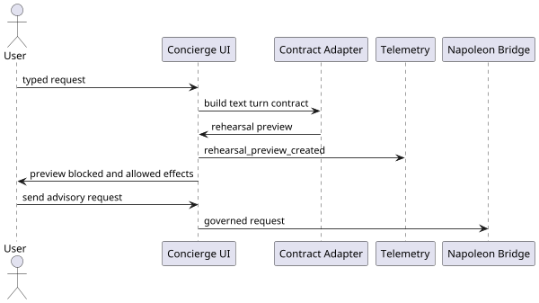
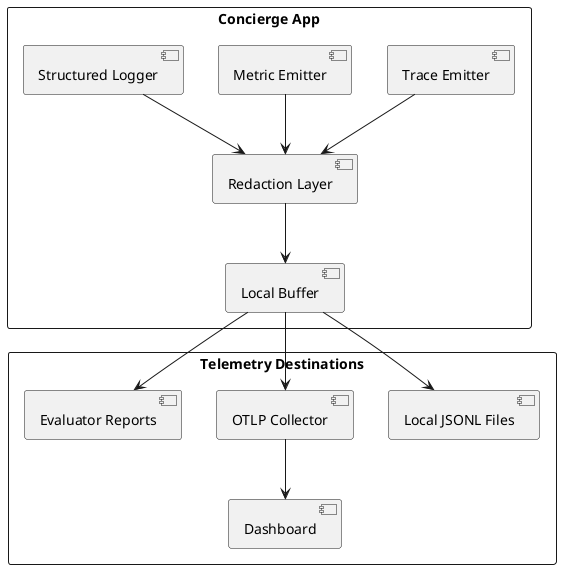

# Architecture

## 1. Recommended architecture

Concierge is a local desktop front-end plus a governed Napoleon bridge.

The front-end owns interaction capture and presentation. Napoleon owns orchestration, governance, memory, and agent delegation.

## 2. System diagram



## 3. Evaluator cycle



## 4. Runtime turn sequence



### Rehearsal Mode sequence

Rehearsal Mode is a local preview step before a live Napoleon bridge call. It builds the same text turn contract shape used by the bridge, then displays the understood request, proposed Napoleon path, Chief of Staff review packet, allowed effects, blocked effects, approval state, memory proposal, trace/audit preview, and evaluator-case candidate. It does not contact Napoleon, capture approval, write memory, send externally, dispatch agents, or execute commands.



## 5. Observability pipeline



## 6. Component responsibilities

### Concierge Desktop App

- Owns UI, capture permissions, local rendering, and user controls.
- Does not own Napoleon authority.
- Does not silently retain raw camera or microphone data.

### Local Perception Services

- Convert raw local signals into conservative derived signals.
- Emit uncertainty and evidence.
- Avoid durable emotional labels.

### Concierge Runtime

- Maintains dialogue state.
- Resolves user profile.
- Chooses interaction stance.
- Asks for confirmation when governance requires it.
- Sends governed requests to Napoleon.

### Napoleon Core

- Owns governance, policy, memory, routing, agent registry, Chief of Staff review, and evolution approval.

## 7. Deployment shape

Initial target:

```text
Concierge.app
  app UI
  local settings
  telemetry buffer

local services
  perception service
  voice service
  avatar service

Napoleon bridge
  local or remote API endpoint
  authenticated
  trace-aware
```

## 8. Security boundaries

1. Camera and microphone are owned by local front-end.
2. Raw capture remains local unless user explicitly records or streams.
3. Napoleon receives derived signals, transcripts, and user-approved context.
4. External actions go through Napoleon governance.
5. Child mode is stricter than adult mode.
