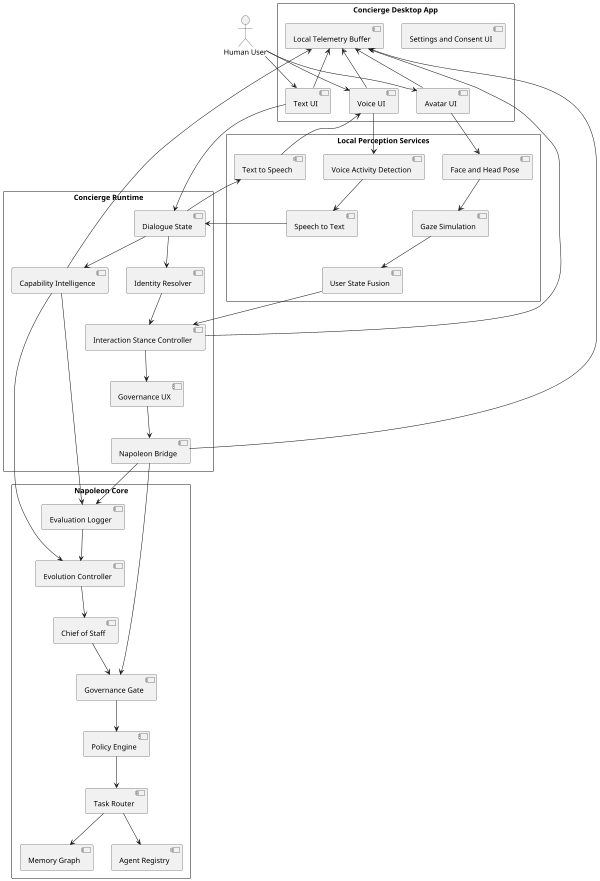
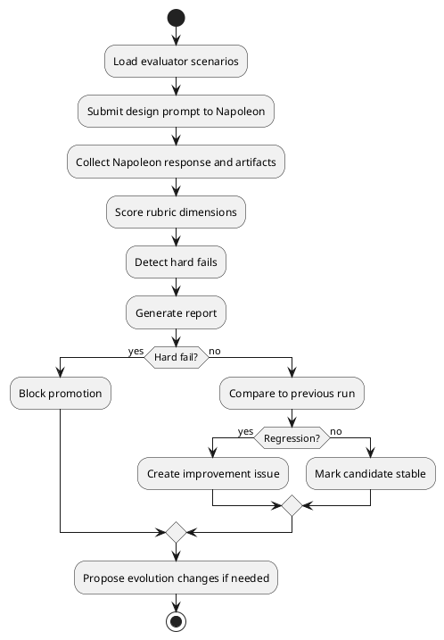
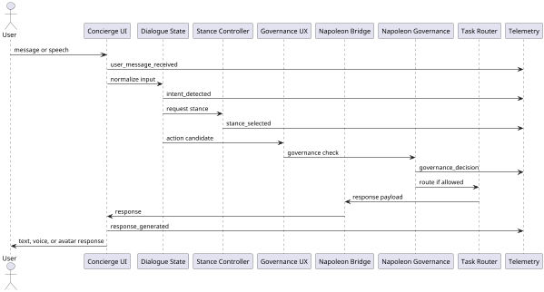
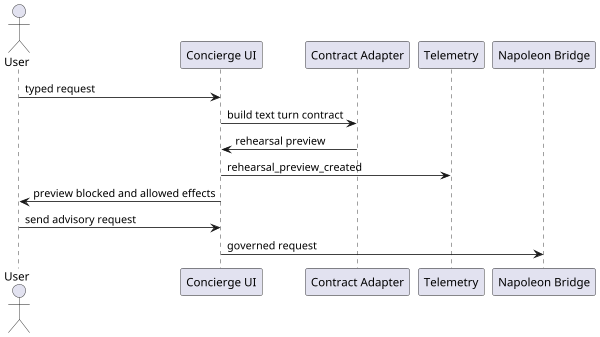
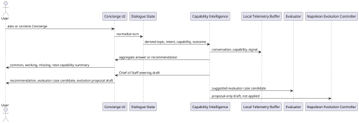
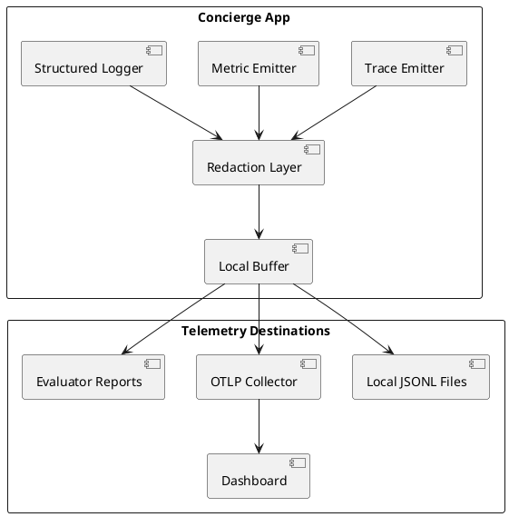

# Architecture

## 1. Recommended architecture

Concierge is a local desktop front-end plus a governed Napoleon bridge.

The front-end owns interaction capture and presentation. Napoleon owns orchestration, governance, memory, and agent delegation.

## 2. System diagram



## 3. Evaluator cycle



## 4. Runtime turn sequence



### Rehearsal Mode sequence

Rehearsal Mode is a local preview step before a live Napoleon bridge call. It builds the same text turn contract shape used by the bridge, then displays the understood request, proposed Napoleon path, Chief of Staff review packet, allowed effects, blocked effects, approval state, memory proposal, trace/audit preview, and evaluator-case candidate. It does not contact Napoleon, capture approval, write memory, send externally, dispatch agents, or execute commands.

Live bridge calls fail closed when the Napoleon endpoint is missing, the Chief of Staff descriptor is missing, descriptor validation fails, descriptor checksum or signature validation fails, authentication fails, the response contract is invalid, local governance is `no_go`, Napoleon returns `deny` or `no_go`, or the bridge times out; governed bridge attempts report the absent-descriptor case as `missing_descriptor` while preserving the detailed `no_descriptor` descriptor reason in telemetry and evidence. This denial rule applies to text turns, memory proposal review handoff, Chief of Staff steering handoff, Chief of Staff taxonomy review handoff, evolution proposal submission handoff, evolution proposal status refresh, new-agent proposal review handoff, and observability trace handoff. Memory proposal review, Chief of Staff steering, evolution proposal submission, evolution proposal status refresh, and new-agent proposal review submissions also fail closed before request fetch when the proposal, record, or draft profile no longer matches the active profile. Text Concierge can store an optional local bridge bearer token and sends it only as a request header: `Authorization` for generated `/v1/concierge/...` bridge requests, or `X-Napoleon-Auth` for explicit Napoleon advisory harness `/cos/descriptor`, `/cos/capabilities`, and `/cos/text-turn` requests. It is never included in request bodies, telemetry, memory proposals, capability exports, bridge evidence records, or readiness proof exports. The configured Napoleon endpoint may be a base URL, any known Concierge bridge operation URL, or an explicit Napoleon advisory harness `/cos/descriptor`, `/cos/capabilities`, `/cos`, or `/cos/text-turn` URL; the UI discards pasted query strings or fragments, strips known operation suffixes, then resolves descriptor discovery to `GET /v1/concierge/chief-of-staff/descriptor` for generated bridge endpoints or `GET /cos/descriptor` for explicit advisory harness endpoints, advisory capabilities to `GET /v1/concierge/chief-of-staff/capabilities` or `GET /cos/capabilities` only after descriptor discovery passes, text turns to `POST /v1/concierge/turn`, steering and taxonomy review handoffs to `POST /v1/concierge/chief-of-staff/steering`, memory proposal review handoff to `POST /v1/concierge/memory-proposals`, new-agent proposal review handoff to `/chief-of-staff/reviews/new-agent-proposals` through the named review target, evolution proposal status refresh to `GET /evolution/proposals/{proposal_id}/status` through the named read-only status target, and observability trace handoff to `/observability/traces` through the named trace-evidence target. The app keeps the generated paths, HTTP methods, request-kind metadata, required 200-response fields, and named Napoleon review/evidence handoff metadata in a named bridge operation registry generated into `app/src/generatedBridgeOperations.ts` from `api/napoleon_bridge.openapi.yaml`; runtime TypeScript bridge operation IDs and request-kind types are derived from that generated registry, and repository validation reruns `scripts/generate_bridge_operations.py --check`, so local route, type, and response-shape constants cannot drift silently from the canonical contract. Repository validation also checks that canonical docs mention every generated Napoleon review/evidence/submission/status target by ID, path, and request kind. Runtime bridge URL resolution accepts only named generated operations, not arbitrary caller-supplied paths, and bridge modules must fetch only URLs produced by named generated operation resolution or the explicit `/cos/descriptor`, `/cos/capabilities`, and `/cos/text-turn` advisory harness adapters rather than hard-coded, concatenated, or template-built live targets. Text Concierge displays the same governed route registry and generated-source markers locally for descriptor discovery, advisory capabilities, text turns, memory proposal review, Chief of Staff steering, Chief of Staff taxonomy review, and named Napoleon review/evidence/status targets without exposing endpoint hosts or bearer tokens. Each generated core route shows a route-specific boundary and blocked-effect summary, so descriptor and capability discovery cannot be mistaken for runtime authority, text turns cannot be mistaken for approval capture or task routing, memory proposal review remains proposal-review-only, and Chief of Staff steering cannot apply evolution changes, update registries, append traces, route tasks, or perform side effects locally; taxonomy review is presented as a governed alias of the canonical Chief of Staff steering operation, not a new bridge route. Advisory capability discovery is explicit user-triggered connection metadata: it lists returned capability IDs, labels, descriptions, authority tiers, proposal-only state, runtime authority blocked state, and blocked effects, but it is not Napoleon approval and cannot write memory, capture approval, dispatch agents, send externally, or grant runtime authority. Napoleon agent and profile metadata discovery also uses named governed targets only: `/agents`, `/agents/{agent_id}`, and `/profiles/{profile_id}` may be read for metadata and rendered as connection state for returned agent manifests and the active profile, but those reads cannot dispatch agents, update registries, write memory, capture approval, send externally, or grant runtime authority. Repository validation also scans Concierge runtime source, manifests, and root lockfile declarations for direct process execution, memory or graph access, direct agent/tool dispatch names including `invokeAgent`, `runTool`, and `executeTool`, concatenated or bracketed agent/tool dispatch aliases, direct LLM, agent, memory/graph, shell/process, or alternate transport client dependencies, direct Tauri native bridge invocation including global `__TAURI__` invoke aliases, non-allowlisted Tauri commands, forbidden Tauri native plugin configuration, forbidden Tauri plugin dependencies, unallowlisted browser network calls, remote module imports, and worker entry points such as `fetch`, `WebSocket`, `EventSource`, `XMLHttpRequest`, `sendBeacon`, `Worker`, `SharedWorker`, `importScripts`, `import("https://...")`, static `import` from outside URLs, service-worker registration, external `href`, `action`, `formAction`, `src`, `srcSet`, `poster`, or `ping` targets, bracket-assigned or `setAttribute` external targets, meta-refresh redirects, CSS external `url(...)` or `@import` resource targets, dynamic HTML injection APIs such as `dangerouslySetInnerHTML`, `innerHTML`, `outerHTML`, `insertAdjacentHTML`, `DOMParser`, `createContextualFragment`, or `srcDoc`, `window.open`, `location.assign`, `location.replace`, or `navigator.share`, direct URL fetch targets inside governed bridge modules, hidden media capture, display capture, device enumeration, recording, browser speech/playback APIs plus optional chaining, bracket, and call/apply aliases outside explicit visible permission handlers, and free-form bridge path resolution, so UI code cannot quietly bypass the governed bridge or start future voice/avatar capture before local controls exist. A successful governed response must include a readable contract body, the OpenAPI-required top-level response fields, matching governance, trace, and audit provenance from Napoleon, must not carry a denied or no-go governance outcome, and must not claim memory writes, approval capture, external sends, agent dispatch, registry update, agent activation, or local application in explicit boundary fields or visible response text. Explicit Napoleon advisory harness `/cos/text-turn` endpoints are adapted inside the governed bridge module only: Concierge sends the harness `TextTurnRequest` shape, receives the prepare-only `TextTurnResponse` shape, maps returned governance and candidate-agent provenance into the local response model, records sanitized evidence with target path `/cos/text-turn`, rejects invented recommendation or selected-agent attribution plus text-side side-effect claims, and still treats the response as non-authorizing prepare-only output. Concierge does not synthesize missing trace or audit envelopes for a live success; unreadable live text or governed review handoff response bodies fail closed as contract mismatches with blocked-effect evidence. Live text bridge calls can emit sanitized `bridge_contract_evidence` records for runtime contract comparison. These records contain operation, request kind, transport, path, trace/request/decision/audit IDs, governance outcome, descriptor state, selected agent IDs, effects, and fail-closed reason metadata, but not raw prompt text, response text, endpoint host, or bearer tokens. The local bridge evidence comparator checks captured evidence transport, path, and request kind against the OpenAPI-aligned bridge registry and rejects raw payload or secret fields before records are treated as validation evidence. The UI can export a local bridge readiness proof containing descriptor state, checksum/signature state, descriptor-advertised governed handoff routes, advisory capability discovery state as count/ID/tier metadata, Napoleon metadata discovery state as agent/profile IDs and blocked-effect metadata, evidence capture/comparison status, last operation transport, last operation path, and last failure reason; it omits raw prompts, raw manifests, response bodies, endpoint hosts, bearer tokens, request bodies, and profile bodies, and it is not Napoleon approval. The UI can also compare the current proof with the previous proof exported in the same app session, using only sanitized descriptor, advisory capability, Napoleon metadata, and evidence fields. Early local failures preserve the relevant text-turn, memory proposal, Chief of Staff steering, taxonomy review, evolution proposal submission, evolution proposal status refresh, new-agent proposal review, or observability trace handoff blocked-effect list, remote failures preserve Napoleon-supplied blocked effects plus returned decision, audit, and governance references where available, and none of these failures execute side effects, write memory, dispatch agents, send externally, append remote audit records, update registries, activate agents, apply evolution, or capture approval.

Evolution proposal lifecycle records are browser-local display metadata derived from proposal drafts, governed intake attempts, read-only governed status refreshes, and returned Napoleon decision/audit/trace references. They can show local states such as drafted, accepted for review, rejected, blocked, or a refreshed Napoleon-reported lifecycle state, and they explicitly show status refresh as unavailable until Napoleon advertises `evolution_proposal_status`. They do not poll unknown routes, capture approval, write memory, update registries, apply evolution, dispatch agents, send externally, route tasks, append traces, or become Napoleon status authority.

The local `schemas/concierge_text_turn.schema.json` text-turn envelope requires the same `requestKind: "text_turn"` discriminator as the OpenAPI request body, and the sample text-turn contract validates against that schema so local examples cannot omit the canonical request kind.

Capability discovery also fails closed if the returned response claims approval capture, memory writes, agent dispatch, or external sends, and those response-side claims stay separate from Concierge's false local side-effect boundary fields. The advisory capabilities panel, local telemetry, and sanitized readiness proof exports show only the remote claim booleans and blocked effect names, not raw response bodies.

For explicit Napoleon advisory harness endpoints, live text sends normalize `/cos`, `/cos/descriptor`, `/cos/capabilities`, and `/cos/text-turn` to `POST /cos/text-turn`, then require a matching `GET /cos/trace/{trace_id}` proof before accepting the response as successful evidence. Generated Concierge-compatible endpoints continue to use the generated `/v1/concierge/turn` route.

Governance review submissions also re-check the review profile against the active profile and fail closed before any request fetch if the user has switched context.

The visible governed route registry includes the generated OpenAPI-required response fields for each route, including descriptor discovery, advisory capability discovery, text turns, memory proposal review, Chief of Staff steering, and taxonomy review, so contract-mismatch expectations are visible without exposing endpoint hosts, bearer tokens, prompts, request bodies, or response bodies. For descriptor discovery, advisory capability discovery, and text turns, the same route view also shows separate accepted-endpoint-form rows for the explicit `/cos`, `/cos/descriptor`, `/cos/capabilities`, and `/cos/text-turn` endpoint forms; text turns also show a required-proof row for matching `/cos/trace/{trace_id}` evidence before successful evidence is accepted.

Browser peer and transport APIs such as `RTCPeerConnection`, `webkitRTCPeerConnection`, and `WebTransport`, including bracket-style constructor aliases such as `window["RTCPeerConnection"]` and `window["WebTransport"]`, are treated as ungoverned network paths outside the bridge, so future UI features cannot open peer or session transports beside Napoleon.

Beacon sends are also blocked through direct, call/apply, and bracket-style navigator aliases, including `navigator.sendBeacon.apply(...)`, `window["navigator"]["sendBeacon"]`, and `globalThis["navigator"]["sendBeacon"]`, so UI code cannot emit one-way audit, prompt, proof, or telemetry payloads around the governed bridge.

Privileged browser device, permission, location, account, notification, push, and payment APIs, including bracket-style aliases such as `navigator["usb"]["requestDevice"]`, call/apply aliases such as `navigator.permissions.query.call(...)`, `navigator.share.apply(...)`, `navigator.serviceWorker.register.call(...)`, `Notification.requestPermission.call(...)`, `registration.pushManager.subscribe.call(...)`, `PaymentRequest.call(...)`, `navigator["geolocation"]["getCurrentPosition"]`, `globalThis["navigator"]["share"]`, `globalThis["navigator"]["serviceWorker"]["register"]`, `window["Notification"]["requestPermission"]`, and Payment Request constructor calls such as `window["PaymentRequest"] (...)`, are treated as ungoverned authority paths outside visible Concierge controls and the governed Napoleon bridge.

Dynamic HTML injection APIs, including bracket-style aliases such as `container["innerHTML"]`, `window["DOMParser"]`, `range["createContextualFragment"]`, lowercase `srcdoc`, `document.write`, `document.writeln`, and prototype call/apply aliases such as `HTMLDocument.prototype.write.call(...)` and `HTMLDocument.prototype.writeln.apply(...)`, are treated as ungoverned markup paths because they can smuggle external targets around static UI checks.

Dynamic code execution APIs, including bracket-style aliases for eval and Function calls, constructor calls with or without `new`, indirect constructor-constructor access, dot-property aliases such as `new window.Function(...)`, and string-timer aliases, are treated as hidden authority paths and are rejected from Concierge runtime source.

Direct process aliases with concatenated bracket names such as `childProcess["exec" + "File"] (...)`, `childProcess["spawn" + "Sync"] (...)`, `globalThis["Deno"]["Com" + "mand"] (...)`, and `window["Bun"]["spawn" + "Sync"] (...)` are rejected so UI code cannot execute local commands beside Napoleon governance.

Direct memory and graph write aliases, including split bracket forms on arbitrary objects such as `memoryClient["write" + "Memory"]`, `memoryClient["save" + "Memory"]`, `memoryClient["memory" + "Graph"]`, and `graphClient["graph" + "_write"]`, are rejected so memory review remains proposal-only through Napoleon instead of becoming a local write path.

Direct agent and tool dispatch aliases, including split bracket forms on arbitrary objects such as `router["dispatch" + "Agent"]`, `globalThis["call" + "Tool"]`, and `tools["execute" + "Tool"]`, are rejected so Concierge cannot become a local router or tool runner beside Napoleon.

JavaScript runtime process APIs such as `execFile`, `execFileSync`, `execSync`, `spawnSync`, `Deno.Command`, `Bun.spawn`, `Bun.spawnSync`, and bracket-style aliases such as `childProcess["execFile"]`, `globalThis["Deno"]["Command"]`, and `window["Bun"]["spawnSync"]` are treated as direct command execution and rejected from Concierge runtime source.

Browser persistence and context-state APIs, including IndexedDB, Cache Storage, call/apply aliases such as `indexedDB.open.call(...)`, bracketed persistence call/apply aliases such as `globalThis["indexedDB"]["open"].call(...)` and `window["caches"]["put"].apply(...)`, mixed bracket/dot persistence aliases such as `globalThis["indexedDB"].open(...)` and `window["caches"].put.apply(...)`, cookie writes such as `document["cookie"] = ...` and `window["document"].cookie = ...`, `localStorage`/`sessionStorage` method reads, method writes, method call/apply aliases such as `localStorage.setItem.call(...)`, bracketed storage call/apply aliases such as `globalThis["localStorage"]["setItem"].call(...)` and `window["sessionStorage"]["clear"].apply(...)`, mixed bracket/dot storage aliases such as `window["localStorage"].setItem(...)` and `window["localStorage"].setItem.call(...)`, property assignments, method removals, property deletions, and clears outside bounded connection settings, local settings, telemetry, and capability metadata modules, including inside governed bridge modules, `history.pushState`/`history.replaceState`, history call/apply aliases such as `history.pushState.call(...)`, bracketed history call/apply aliases such as `window["history"]["pushState"].call(...)`, mixed bracket/dot history aliases such as `window["history"].pushState(...)`, `window.name`, and bracket-style aliases, are treated as ungoverned retention paths outside the explicit bounded local metadata stores. Bounded storage modules may read, write, or remove only approved endpoint, token, privacy-toggle, telemetry-buffer, capability-ledger, and taxonomy keys, including when those keys are routed through simple local constants, so new raw prompt, proof, transcript, descriptor, or token caches cannot be added silently.

The same repository validation treats lowercase and SVG target spellings such as `srcset`, `formaction`, and `xlink:href` as external browser targets, including bracket assignment and `setAttribute` forms, so alternate markup spellings cannot bypass the governed bridge boundary.

Image preload source-set targets such as `imageSrcSet` and `imagesrcset` are treated as external resource targets in static markup, property assignment, bracket assignment, and `setAttribute` forms, so responsive preload candidates cannot fetch images outside the governed bridge.

Object and embed `data` targets are treated as external load targets only in object/embed element contexts, including static markup, property assignment, bracket assignment, and `setAttribute` forms, so plugin-style content cannot create another outside channel while ordinary application data fields remain usable.

Direct assignment to `location`, `window.location`, `document.location`, `globalThis.location`, or bracket-style `window["location"]` aliases is treated as browser navigation outside the governed bridge, including variable-based targets, matching the existing checks for `location.href`, `location.assign`, `location.replace`, and bracketed `location["href"]`, `location["assign"]`, or `location["replace"]` aliases.

Programmatic form submission APIs such as `form.submit()`, `form.requestSubmit()`, `document.forms[0].submit()`, bracket-style submission aliases, and prototype call/apply aliases such as `HTMLFormElement.prototype.submit.call(...)` and `HTMLFormElement.prototype.requestSubmit.apply(...)` are treated as external-send side channels outside the governed bridge, even when a form target is assembled dynamically.

Programmatic DOM clicks such as `anchor.click()`, `downloadLink.click()`, `button.click()`, bracket-style `click` aliases, and anchor/button prototype call/apply aliases such as `HTMLAnchorElement.prototype.click.call(...)` and `HTMLButtonElement.prototype.click.apply(...)` are treated as navigation or form side channels outside the governed bridge.

Browser cross-context messaging such as `postMessage`, `BroadcastChannel`, `MessageChannel`, postMessage call/apply aliases such as `window.postMessage.call(...)`, and constructor call/apply aliases such as `BroadcastChannel.call(...)` and `window.MessageChannel.apply(...)` is treated as a side channel so UI code cannot relay local prompts, responses, tokens, or proof metadata to another browser context outside governed visible flows.

Direct browser clipboard reads, writes, mixed dot/bracket clipboard aliases, optional-chained calls such as `navigator.clipboard.writeText?.(...)`, call/apply aliases such as `navigator.clipboard.writeText.call(...)`, and legacy copy/paste commands are treated as local data side channels so UI code cannot move prompts, responses, tokens, or proof metadata outside governed visible export flows. Optional-chained browser side-channel calls such as `fetch?.(...)`, `navigator.sendBeacon?.(...)`, `window.open?.(...)`, `postMessage?.(...)`, service-worker registration, share, and direct bridge-module URL fetches are blocked for the same reason: optional chaining cannot create an alternate external-send or browser-context path around the governed bridge.

Browser file picker APIs including call/apply aliases such as `window.showOpenFilePicker.call(...)` and `globalThis.showDirectoryPicker.apply(...)`, FileReader constructors including bracket-style aliases such as `window["FileReader"] (...)`, and FileReader `readAs...` methods including call/apply aliases such as `reader.readAsText.call(...)` are treated as local data side channels so UI code cannot read, write, or export local files outside governed visible import/export flows.

WebAssembly compilation/instantiation, including `Module` and `Instance` constructors and bracket-style aliases, plus object URL creation aliases such as `URL["createObjectURL"] (...)`, `URL.createObjectURL.call(...)`, and `window["URL"].createObjectURL.call(...)` are treated as local executable side channels so UI code cannot introduce hidden runtime behavior outside governed visible flows.

Descriptor discovery is treated as connection state, not authority. Text Concierge shows endpoint presence, descriptor discovery, validation, checksum state, signature state, runtime authority, cache policy, and advertised handoff routes before live sends. Live discovery preserves explicit `supportedHandoffs` / `supported_handoffs` values from the returned descriptor, including generated Napoleon review, request, governance-evaluation, evolution-submission, new-agent-review, evaluator-review, observability, memory, steering, taxonomy, and text-turn handoff names, so a route-incomplete descriptor remains blocked instead of inheriting Concierge's built-in defaults; explicit handoff lists with unknown route names fail closed as invalid descriptors instead of being silently filtered. It also summarizes live bridge readiness from endpoint state, descriptor integrity, in-session sanitized bridge evidence capture/comparison status, runtime-validation source, promotion gate, last live-send status and fail-closed reason, evaluator HTTP target/failure plus descriptor evaluator-handoff advertised/source/failure metadata when imported, and blocked effects, while explicitly stating that readiness is not Napoleon approval and does not grant memory writes, agent dispatch, approval capture, or external sends. The governed route panel shows local runtime-contract alignment metadata that distinguishes exact path-set mismatch from mapped Napoleon runtime compatibility without becoming runtime validation or approval. The readiness panel groups local display signals into Napoleon bridge descriptor, governed text-turn route, evaluator HTTP validation, last live evidence, promotion gate, and authority boundary sections; it also lists current promotion blockers in plain English from the same local signals. Those groups and blocker summaries do not create a new approval source or override proof export rules. Local harness validation, local simulation validation, and missing runtime-validation source remain warning states and promotion-blocked until real Napoleon runtime validation is explicitly proven; sanitized readiness proof exports use the same rule and preserve missing runtime source as unavailable rather than real runtime evidence. The accepted readiness proof importer can use either a sanitized `concierge_bridge_readiness_proof` export or a sanitized successful `make live-runtime-validation` `summary.json`, and it accepts only real-runtime, evaluator-passed, privacy-passed, promotion-ready, side-effect-free metadata as local review context rather than approval. The composer includes a live-send preflight checklist for text readiness, endpoint configuration, descriptor discovery, descriptor integrity, descriptor-advertised `text_turn` route, local governance send gate, allowed effects, blocked effects, Rehearsal Mode state, runtime-validation source, evidence capture/comparison, evaluator HTTP handoff status, and promotion-gate warnings; each checklist row renders its `ready`, `warning`, or `blocked` status as readable text, and the checklist is local display state only and does not approve or send. The composer preflight also derives a single plain-English main blocker or warning plus a local next-step hint from those rows, without becoming a new send gate. When Rehearsal Mode is off and a direct send is blocked by a preflight item that is not already represented by the disabled local-governance send state, the composer action area repeats the first blocked preflight reason before the guarded submit attempt. Descriptor auth failure, timeout, HTTP failure, missing `text_turn` route, and descriptor-unadvertised evaluator review are shown as specific rows with the fail-closed reason instead of being hidden behind a generic blocked summary. Local governance blocks show the returned outcome such as `no_go` in the governance send gate row, and the allowed-effects row switches to `none`, so a non-executable decision is visible before any send attempt. While Rehearsal Mode is active, the checklist remains a warning state and must not report direct live-send readiness, even if endpoint, descriptor, text, and governance checks otherwise pass. Enabling Rehearsal Mode also clears captured bridge evidence readiness and rendered readiness proof exports so live validation cannot linger in local-only preview mode. Active profile changes also clear captured bridge evidence readiness and rendered readiness proof exports so adult-owner, guest, collaborator, and child-protected validation state is not mixed. Memory proposal review, Chief of Staff steering, and Chief of Staff taxonomy review panels also show governed handoff readiness from draft, endpoint, descriptor preflight, descriptor-advertised handoff route, Rehearsal Mode state, and blocked-effect state before enabling submission; Chief of Staff steering drafts also show and export the current handoff blocker or ready state, next local action, and blocked effects as local explanation metadata only; existing Chief of Staff steering drafts re-evaluate against current connection readiness, so an endpoint configured after drafting can enable the same draft only when the descriptor advertises the required route, without treating the earlier local draft state as authority. Observability trace handoff uses the same endpoint, descriptor-advertised route, Rehearsal Mode, and blocked-effect readiness pattern before sanitized trace evidence can be submitted. Those summaries are local display only and are not Napoleon approval or permission to apply changes. The submit helpers also fail closed when Rehearsal Mode is active, or when the descriptor is ready for text turns but does not advertise the required review or handoff route, so direct handoff paths cannot reach Napoleon while Concierge is rehearsing locally or while Napoleon exposes only text-turn capability. Captured evidence is compared locally against the named bridge operation registry for canonical transport, path, and request kind and rejected if it contains raw or secret fields before the readiness panel marks evidence comparison as passed. Explicit `/cos/text-turn` advisory harness app sends and evidence capture also fetch `/cos/trace/{trace_id}` after a successful text turn and store only whether the observability envelope was observed and matched the returned text-turn trace; readiness comparison rejects successful `/cos/text-turn` evidence without that matching trace metadata; it does not retain the trace body, endpoint host, request body, response body, token, or raw prompt. The local UI can simulate discovered, missing, and checksum/signature mismatch states, and it can explicitly fetch `/v1/concierge/chief-of-staff/descriptor` from generated bridge endpoints or `/cos/descriptor` from explicit Napoleon advisory harness endpoints. Descriptor discovery clears captured bridge evidence readiness plus rendered readiness proof exports and comparison state so pre-discovery evidence is not left visible or reusable after the connection state changes. Advisory capability discovery clears rendered readiness proof exports and comparison state so capability metadata in local proofs is regenerated from the latest discovery result. Descriptor discovery preserves fail-closed auth failure, timeout, unreadable descriptor response body, and HTTP failure states instead of flattening them into a generic missing descriptor, and the OpenAPI descriptor connection schema names those same states for text turns, memory proposal review, Chief of Staff steering, taxonomy review, and observability trace handoffs. Subsequent text, memory proposal, Chief of Staff steering, taxonomy review, and observability trace handoff preflights surface those same blocked reasons before fetch. Active profile and connection-boundary changes clear visible bridge failure banners with proof, delegation, and handoff state so a blocked live-send result is not reused across child, guest, collaborator, or owner contexts. A fetched descriptor is still only a preflight connection signal; invalid, missing, failed, mismatched, or route-incomplete discovery keeps affected live sends blocked. Endpoint, bearer-token, and descriptor-mode changes invalidate fetched descriptor state and reset captured bridge evidence readiness until discovery and a fresh governed bridge attempt succeed again. Text turns must receive discovered descriptor state with an advertised `text_turn` route before they can attempt a live request; Chief of Staff steering handoff, taxonomy review handoff, memory proposal handoff, and observability trace handoff must receive discovered descriptor state with their required handoff route before they can attempt a live request. All of these paths must fail closed instead of substituting Concierge's built-in descriptor.

Governed handoff readiness next-step guidance preserves the specific descriptor preflight blocker, including missing descriptor, stale descriptor, integrity mismatch, auth failure, timeout, and HTTP failure, so review handoffs do not collapse distinct repair actions into a generic transport message.

Concierge renders a separate Napoleon delegation panel even before delegation provenance is returned. In the empty state, handled by, target capability, provenance source, selected agents, why selected, allowed effects, blocked effects, governance state, trace ID, audit ID, authority boundary, and proof alignment are shown as `not returned`, so Concierge does not silently imply a capability or agent handled the response. When Napoleon returns delegation provenance, the same panel fills in returned handled-by provenance, the returned target capability when present, provenance source, selected agents, selection reasons, allowed effects, blocked effects, governance state, trace ID, audit ID, an explicit authority-boundary row stating that returned bridge provenance is not approval, memory, dispatch, external send, or local application, and proof alignment that ties the delegation to the same returned trace/audit as the Napoleon response proof rather than to imported readiness proof. If Napoleon returns a `targetAgent` capability ID without selected-agent delegation, the delegation panel shows the returned target capability as the handler, adds a display-only advisory capability label in transcript, delegation, and last-successful-proof display when that returned ID matches explicitly discovered Chief of Staff capability metadata, marks the provenance source as target-capability-only, marks proof alignment as missing selected-agent proof, shows the same authority-boundary row, and still marks selected agents, why selected, and detailed delegation fields as `not returned`. Each successful Napoleon transcript response also shows its source as the governed bridge, its attribution boundary as returned bridge provenance only, the returned target capability when present, and the response blocked effects. Fail-closed Napoleon bridge attempts also annotate the assistant failure message with a blocked bridge source, a boundary that no Napoleon response was accepted, the active profile mode, and blocked effects when available. After a successful live text turn, Concierge also renders a last successful Napoleon proof panel from returned bridge metadata: governance outcome, profile mode, decision ID, response trace, audit ID, attribution boundary, handled-by provenance, returned target capability, selected-agent provenance, selected-agent selection reasons, general proof alignment, recommendation proof alignment, allowed effects, and blocked effects. The composer also shows a compact Latest Napoleon turn summary derived from that same returned proof, with handled-by provenance, governance, trace, blocked effects, boundary, and proof alignment kept visible near the next send action; before proof exists the same fields stay explicitly `not returned`. Returned delegation that marks forbidden authority effects such as `agent_dispatch` as allowed, including case or spacing variants of forbidden labels, or advisory harness candidate agents as runtime-invoked, is rejected as a contract mismatch before it can be displayed as provenance. Visible delegation, proof governance/profile/decision/trace/audit rows, successful and fail-closed transcript metadata, governed review responses, fail-closed bridge, and governed handoff rows also redact unsafe returned provenance values, including returned request, profile, governance, trace, decision, audit, endpoint-like strings, loopback hosts, bearer credentials, authorization text, token-like values, and secret-like values, before rendering while preserving safe governance, effect, and provenance labels. Redacted target-capability or recommendation metadata is shown as metadata state and omitted from attribution-style proof summaries or proof-alignment claims. The delegation body omits selected-agent "found" sentences when the returned selected-agent name or contribution summary redacts to a placeholder or normalizes to an empty contribution, so redacted or content-free metadata is not converted into a finding claim. If Napoleon returns a `targetAgent` capability ID without selected-agent delegation, the proof panel, latest-turn summary, and sanitized proof export preserve that returned capability as target capability, not as selected-agent provenance, and mark selected-agent proof as not returned. The proof panel and sanitized proof export both include explicit proof alignment plus an explicit attribution boundary derived only from returned target capability or selected-agent provenance. The sanitized proof export also includes selected-agent selection reasons and an explicit handled-by field, and redacts unsafe returned governance, profile mode, decision, trace, and audit values before local proof JSON is created. This panel is display-only provenance; it is not approval, memory permission, agent dispatch permission, or external-send permission. Concierge can export the proof as sanitized local metadata and compare it with the previous proof exported in the same app session using returned metadata only, including profile mode, handled-by provenance, proof alignment, attribution boundary, and selected-agent selection reasons; comparison labels redacted, unavailable, and empty proof fields or list entries as metadata states rather than returned authority values, and does not create Napoleon audit evidence or authority. The proof comparison also shows a sanitized current-proof review summary for handled-by provenance, governance, trace, blocked effects, attribution boundary, and proof alignment; this summary is local display metadata only and excludes raw response text, endpoints, bearer tokens, request bodies, and response bodies. Changing the active user profile, bridge endpoint, bearer token, descriptor mode, discovered descriptor connection state, or enabling Rehearsal Mode clears the rendered proof and delegation presentation so returned evidence from one profile, connection, or live/local mode context is not reused for another. Those changes also clear local governance and memory review drafts plus governed handoff result panels, so proposal-only review controls cannot reuse adult, guest, collaborator, child-protected, connection, descriptor, or live/local context after the user switches state. Active user profile changes additionally clear local Chief of Staff steering and taxonomy review drafts because those drafts carry profile-scoped capability evidence and review wording; endpoint, bearer-token, descriptor, and Rehearsal Mode changes clear local Chief of Staff taxonomy review drafts so taxonomy packets cannot be reused across stale handoff context. Concierge only attributes statements such as "Passive Brain found...", "Research Analyst reported...", "Research Analyst confirmed...", "Research Analyst assessed...", "Research Analyst concluded...", "Research Analyst recommended...", or other title-case agent-style contribution claims when the bridge response contains that contribution and the delegation trace/audit IDs match the response envelopes; redundant returned "found" prefixes are normalized so Concierge does not duplicate wording or invent content. The selected-agent attribution vocabulary is shared by the bridge validation paths so new guarded verbs do not drift between known-agent and title-case agent-style checks. The same validation path accepts found, identified, reported, surfaced, confirmed, verified, assessed, concluded, and recommended selected-agent wording only when returned delegation proof names the selected agent, a contribution that actually matches the claim, governance state, trace ID, and audit ID aligned to the response envelopes. Concierge only relays statements such as "Napoleon recommends..." when matching recommendation provenance includes the recommended contribution and trace/audit IDs that match the response envelopes. If live response text claims a selected-agent contribution or Napoleon recommendation without matching provenance, the bridge fails closed as a contract mismatch. Rendered fail-closed selected-agent proof mismatches must show only blocked bridge metadata and must not display rejected response text, mismatched contribution proof, or a last-successful-proof panel. Missing or mismatched provenance is rejected rather than invented. Live text responses must keep the returned profile mode aligned with the active Concierge user profile; child protected, guest, and collaborator turns cannot be widened into adult owner or owner-only scope by response text or metadata.

Sanitized Napoleon response proof exports canonicalize returned allowed-effect and blocked-effect labels to lower snake-case after redaction, so casing, spaces, and hyphens do not create distinct returned authority metadata in local proof comparison.

The Latest Napoleon turn composer summary also covers fail-closed bridge attempts. When no Napoleon response is accepted, the summary switches to blocked status and shows sanitized failure reason, governance when returned, trace reference, blocked effects, no-accepted-response boundary, descriptor detail when applicable, and a local next-step hint; this remains display-only and does not authorize a retry, memory write, approval capture, agent dispatch, external send, or local application. A companion Napoleon turn timeline compares the latest accepted response with the latest blocked bridge attempt using the same sanitized proof and failure metadata, so operators can see success and fail-closed state together without treating either local display as approval or permission. Its turn comparison rows explain why the attempt was blocked, the prior accepted handler, governance and trace changes, current blocked effects, current live-send preflight retry guidance, and the local next step; these rows are derived from sanitized display and preflight metadata only and do not expose endpoints, tokens, raw request bodies, raw response bodies, or Napoleon authority.

Reusable local bridge fixtures live in `app/src/napoleonBridgeFixtures.ts`. They cover delegated success, auth failure, contract mismatch, and timeout behavior so bridge handling can be tested without a live Napoleon endpoint while preserving the same fail-closed semantics. Canonical request artifacts live in `examples/sample_memory_proposal_request.json`, `examples/sample_child_memory_proposal_request.json`, `examples/sample_chief_of_staff_steering_request.json`, `examples/sample_child_chief_of_staff_steering_request.json`, `examples/sample_governance_review_request.json`, `examples/sample_chief_of_staff_taxonomy_review_request.json`, and `examples/sample_child_chief_of_staff_taxonomy_review_request.json`; repository validation checks them against the OpenAPI request schemas and verifies that the handoff boundary remains proposal-only, including nested fields that might otherwise imply approval, memory writes, agent dispatch, external sends, or local application. The child memory proposal artifact must remain in child protected mode and require guardian review. The child Chief of Staff steering artifact must remain in child protected mode and include explicit child-safety caution on the recommendation. The governance review artifact must use the canonical `chief_of_staff_steering_handoff` request kind, explicit `governance_review_handoff` payload marker, and child-protected guardian review wording without local approval capture. Taxonomy review artifacts use the canonical `chief_of_staff_steering_handoff` request kind with a taxonomy review payload rather than a separate free-form bridge request kind. The canonical descriptor response artifact lives in `examples/sample_chief_of_staff_descriptor_response.json`; repository validation checks it against the OpenAPI response schema and verifies contract-only, fail-closed descriptor boundaries before descriptor discovery can be treated as local contract evidence. Canonical governed response artifacts live in `examples/sample_text_turn_response.json`, `examples/sample_child_text_turn_response.json`, `examples/sample_memory_proposal_response.json`, `examples/sample_child_memory_proposal_response.json`, `examples/sample_chief_of_staff_steering_response.json`, `examples/sample_child_chief_of_staff_steering_response.json`, `examples/sample_governance_review_response.json`, `examples/sample_chief_of_staff_taxonomy_review_response.json`, and `examples/sample_child_chief_of_staff_taxonomy_review_response.json`; repository validation checks them against the OpenAPI response schemas, verifies that governance, trace, audit, delegation, and recommendation references agree, and rejects response-side claims that memory was written, approval was captured, agents were dispatched, external sends occurred, or proposals were applied locally before the artifacts can be treated as local contract evidence. Repository validation also compares every `examples/sample*_request.json` and `examples/sample*_response.json` file with the registered OpenAPI example inventory, so adding a governed sample without registering it fails validation. The child text response artifact must remain review-gated, preserve guardian review wording, child profile evidence, blocked secret-keeping, and explicit false side-effect fields. The child memory response artifact must remain review-only, preserve guardian review wording, preserve child profile and proposal evidence, keep secret-keeping blocked, and keep memory write, approval capture, agent dispatch, external send, and local application fields false. The child Chief of Staff steering response artifact must remain review-only, preserve guardian review wording, child profile evidence, child capability evidence, blocked secret-keeping, and no local application. The governance review response artifact must remain review-only, preserve child-protected guardian review wording, and keep memory write, approval capture, agent dispatch, external send, and local application fields explicitly false. Taxonomy review response artifacts must remain review-only, preserve capability taxonomy evidence, and keep local taxonomy application plus all side-effect fields explicitly false; the child-protected taxonomy response artifact must also preserve guardian review wording and child profile evidence. A local HTTP bridge harness lives in `scripts/local_bridge_harness.py`; it serves Napoleon-compatible descriptor, text turn, steering, memory proposal, and evaluator endpoints for smoke validation, including deterministic text-turn, Chief of Staff steering, and memory proposal review responses that claim forbidden side effects so local checks can prove Concierge rejects them. The harness is not a substitute for a real Napoleon runtime. `make eval-http-local-harness` runs the evaluator in HTTP mode against that local harness to verify transport plumbing while preserving the separate requirement for real Napoleon endpoint validation. Evaluator HTTP mode uses the named evaluator review target: generated Concierge-compatible endpoints and the local harness use `/v1/concierge/evaluate`, while Napoleon root or explicit evaluation review endpoints use `/chief-of-staff/reviews/evaluation`. The governed route panel must label this as an evaluator-review target and keep evaluator approval, release approval, memory write, agent dispatch, external send, registry update, trace append, routing, and local application visibly blocked. Text Concierge settings include a local harness endpoint preset for `http://127.0.0.1:8787`; selecting it only configures the governed endpoint and descriptor preflight, and does not start, stop, or control the harness process or grant authority.

The adult and child Chief of Staff steering request artifacts must also carry schema-shaped metadata-only learning signals that match the selected capability, request trace, active profile, child minimization rules where applicable, and proposal-only governance boundary.

The local bridge harness includes browser CORS preflight headers so the rendered Text Concierge shell can exercise the local endpoint preset during manual validation. This does not make the harness a real Napoleon runtime, does not grant authority, and does not change the governed bridge contract.



### Conversation Capability Intelligence sequence

Conversation Capability Intelligence records derived metadata about conversation capability performance. It is local-first and proposal-only. It can explain common conversations, working capabilities, missing capabilities, architecture blockers, and recommended next capabilities, but it cannot implement changes, grant approval, write memory, dispatch agents, or send externally. Capability answers and Chief of Staff steering drafts filter source evidence to the active profile before aggregation or recommendation, so child-protected, guest, collaborator, and owner evidence is not mixed across contexts. Capability answer drilldowns and review packet exports may include sanitized latest accepted or blocked Napoleon turn evidence from the local presentation layer, but this evidence excludes raw bridge data and remains non-authorizing local context.

Chief of Staff steering converts the highest-ranked local capability recommendation into a proposal-only review packet with an evaluator case candidate and evolution proposal draft. The evolution proposal evidence is selected from the same missing or degraded recommendation bucket that produced the recommendation, so correctly blocked unsafe traces are not attached just because they share a capability label. The packet remains local unless a governed Napoleon endpoint is configured, descriptor preflight passes, and Rehearsal Mode is off. The UI shows handoff readiness for draft, endpoint, descriptor preflight, Rehearsal Mode state, and blocked effects before the submit control is enabled. Clearing the local capability ledger clears derived steering drafts, review responses, and failure states so stale local evidence cannot be submitted. When submitted, Concierge sends an `evolution_proposal_review` request through a named governed bridge target and requires Napoleon governance, trace, audit, and generated required response fields before displaying the review response. Generated Concierge-compatible endpoints and the local harness use `/v1/concierge/chief-of-staff/steering`; Napoleon root endpoints or explicit evolution review endpoints use `/chief-of-staff/reviews/evolution-proposals`. Child-protected submissions add explicit child-safety caution, child-protected profile scope, and guardian/owner review wording to the packet before it leaves Concierge. Remote `deny` or `no_go` outcomes are blocked handoff failures, not successful reviews, and any review response that omits required top-level fields or claims local application, memory writes, approval capture, agent dispatch, or external sends fails closed as a contract mismatch. Submission does not apply changes locally, write memory, dispatch agents, send externally, or capture approval. The governed route panel must label this as an evolution-review target and keep evolution application, approval capture, registry update, memory write, agent dispatch, external send, trace append, routing, and local application visibly blocked.

Explicit evolution proposal submission follows a separate governed bridge target for Napoleon's `/evolution/proposals` contract path with the `evolution_proposal_submission_handoff` request kind. The Text UI can draft and export this submission packet from a Capability Intelligence review packet, then submit it only when descriptor discovery advertises `evolution_proposal_submission`, endpoint preflight passes, active profile still matches, and Rehearsal Mode is off. It packages proposal evidence for Napoleon intake only; Concierge must not apply evolution changes, update registries, append traces, route tasks, capture approval, write memory, dispatch agents, send externally, or treat a response as local authority. The governed route panel and handoff panel must label this as a proposal-submission target and keep evolution application, registry update, approval capture, trace append, routing, local application, memory write, agent dispatch, and external send visibly blocked.

Evolution proposal lifecycle status refresh follows a read-only governed bridge target for Napoleon's `/evolution/proposals/{proposal_id}/status` contract path with the `evolution_proposal_status_handoff` request kind and `evolution_proposal_status` operation. The Text UI can refresh local lifecycle metadata only when descriptor discovery advertises `evolution_proposal_status`, endpoint preflight passes, the active profile still matches the proposal record, and Rehearsal Mode is off. The request carries no proposal body, and the response can update only browser-local metadata such as lifecycle state, latest known outcome, and returned decision/audit/trace references; Concierge must not infer approval, apply evolution, update registries, capture approval, write memory, dispatch agents, send externally, route tasks, append traces, or treat status as local authority.

Explicit observability trace handoff follows a separate governed bridge target for Napoleon's `/observability/traces` contract path with the `observability_trace_handoff` request kind. It packages sanitized local trace evidence for Napoleon review only and requires descriptor discovery to advertise `observability_trace` before any request is sent. Concierge must not append Napoleon traces, create audit authority, route tasks, capture approval, write memory, dispatch agents, send externally, apply changes, or treat a response as local authority. Responses that claim those effects fail closed as contract mismatches. The governed route panel must label this as a trace-evidence target and keep trace append, audit authority, approval capture, memory write, task routing, agent dispatch, external send, and local application visibly blocked.

Text Concierge exposes this handoff from the local telemetry buffer panel. The panel shows readiness, blocker details, next step, and returned review metadata for the latest sanitized interaction trace while keeping the handoff evidence-only and non-authorizing.

Chief of Staff taxonomy review uses the same governed handoff boundary for local capability taxonomy cleanup packets. Concierge can draft merge, split, and deprecation review recommendations from local metadata, then send the packet through the named evolution proposal review target only after endpoint and descriptor preflight pass and Rehearsal Mode is off. The UI shows the same handoff readiness summary and local next-step hint before submission and keeps the submit control disabled while the draft, endpoint, descriptor preflight, governed handoff route, or Rehearsal Mode state is blocked. Clearing the local capability ledger or changing local taxonomy edits clears taxonomy review drafts, review responses, and failure states so stale taxonomy evidence cannot be submitted. The request uses `chief_of_staff_steering_handoff` on generated endpoints and `evolution_proposal_review_handoff` on explicit Napoleon review endpoints, carries taxonomy review details as payload, and remains an `evolution_proposal_review` packet with evaluator-case and evolution-proposal details. Child-protected taxonomy review handoffs preserve child profile scope and require guardian/owner review wording before they leave Concierge. Submission re-checks the draft affected profiles against the active profile and fails closed before any request if the user has switched context. Napoleon must return matching governance, trace, audit, and generated required response fields before Concierge displays the review response. Any response that omits required top-level fields or claims local taxonomy application, memory writes, approval capture, agent dispatch, external sends, or local application fails closed as a contract mismatch. Submission never applies taxonomy edits locally or changes Napoleon policy/routing.

Post-preview advisory sending follows the same Rehearsal Mode boundary. A local text preview can remain visible while Rehearsal Mode is active, and the unchanged preview remains available after the user turns Rehearsal Mode off. The rendered advisory-send control stays disabled while Rehearsal Mode is active and only enables after Rehearsal Mode is off, the prompt still matches the preview, the preview governance review allows an advisory send, and descriptor preflight still shows the governed bridge is ready. Stale descriptor discovery cache is treated as a descriptor mismatch and blocks the live send before request fetch, so preview creation cannot unlock a live Napoleon bridge call by itself.

Chief of Staff request handoff follows the governed bridge boundary for Napoleon request packets. The named target is `/chief-of-staff/requests` with the `chief_of_staff_request_handoff` request kind. It submits a request for Napoleon review only; Concierge must not treat the request as task routing, registry mutation, trace append, approval capture, memory write, agent dispatch, external send, or local application. The governed route panel must label this as a request-handoff target and keep task routing, registry update, trace append, approval capture, memory write, agent dispatch, external send, and local application visibly blocked.

Governance evaluation handoff follows the governed bridge boundary for Napoleon governance checks. The named target is `/governance/evaluate` with the `governance_evaluation_handoff` request kind. A returned governance decision can inform the visible handoff state, but Concierge must not treat it as local approval capture or permission to route tasks, write memory, dispatch agents, send externally, append traces, update registries, override governance, or apply changes. The governed route panel must label this as a governance-evaluation target and keep governance override, approval capture, memory write, agent dispatch, external send, registry update, trace append, routing, and local application visibly blocked.

Governance review handoff follows a named governed bridge boundary for live review packets. Concierge can display a local governance review state and local acknowledgement, but live submission is enabled only when a Napoleon endpoint is configured, descriptor preflight passes, and Rehearsal Mode is off. Generated Concierge-compatible endpoints and the local harness use the canonical `/v1/concierge/chief-of-staff/steering` route with the `chief_of_staff_steering_handoff` request kind and a `governance_review_handoff` payload marker. Napoleon root endpoints or explicit review endpoints use `/chief-of-staff/reviews/governance` with the `governance_review_handoff` request kind. Both routes carry the same `governance_review` Chief of Staff request type, original decision, trace, audit, profile, approval requirement, blocked effects, and proposal-only boundary. Child-protected handoffs preserve child profile scope and require guardian/owner review wording. Submission re-checks the review profile against the active profile and fails closed before any request if the user has switched context. Remote `deny` or `no_go` blocks the handoff, and any response that omits generated required top-level fields or claims local approval capture, memory writes, agent dispatch, external sends, or local application fails closed as a contract mismatch. Submission never grants approval or performs side effects from Concierge. The governed route panel must label the explicit Napoleon review target as a governance-review target and keep approval capture, governance override, memory write, agent dispatch, external send, registry update, trace append, routing, and local application visibly blocked.

New agent proposal review uses a separate named Napoleon review target, `/chief-of-staff/reviews/new-agent-proposals`, with the `new_agent_proposal_review_handoff` request kind. The Text UI can draft a local new-agent proposal packet from an exported Capability Intelligence review packet, show/export the proposed Napoleon-owned draft agent metadata, and show governed handoff readiness for draft, endpoint, descriptor preflight, advertised `new_agent_proposal_review` route, Rehearsal Mode, and blocked effects before submission. Submission requires the active profile to still match the packet profile, requires descriptor discovery to advertise the new-agent review route, and sends only through the named review target. Napoleon must return matching governance, trace, audit, and generated required response fields before Concierge displays the review response. Any response that claims registry update, agent activation, approval capture, memory write, agent dispatch, external send, or local application fails closed as a contract mismatch. This mapping is review-only: Concierge may package a proposal for Napoleon review, but the governed route panel and handoff panel must keep agent activation, registry updates, agent dispatch, approval capture, memory writes, external sends, trace append, routing, and local application visibly blocked.

Memory proposal handoff follows the same governed bridge pattern. Concierge may submit a live memory proposal review packet only after endpoint and descriptor preflight pass and Rehearsal Mode is off. The UI shows handoff readiness for the proposal draft, endpoint, descriptor preflight, governed handoff route, Rehearsal Mode state, blocked effects, and a local next-step hint before enabling review submission. The packet contains the proposed memory diff, profile, guardian-review need, blocked effects, trace/audit references, and a proposal-only boundary. Submission re-checks the proposal profile against the active profile and fails closed before any request if the user has switched context. Napoleon must return matching governance, trace, audit, and generated required response fields before Concierge displays the review response. Governed review response panels for memory proposal, governance review, Chief of Staff steering, and Chief of Staff taxonomy review show returned governance, decision, authority tier, approval requirement, rationale, trace, audit, blocked effects, and explicit false local side-effect state. Remote `deny` or `no_go` outcomes are blocked handoff failures, not successful reviews, and any review response that omits required top-level fields or claims memory writes, approval capture, external sends, agent dispatch, or local application fails closed as a contract mismatch. The handoff is not available from Rehearsal Mode, and it never writes memory, captures approval, dispatches agents, or sends externally from Concierge.



## 5. Observability pipeline



## 6. Component responsibilities

### Concierge Desktop App

- Owns UI, capture permissions, local rendering, and user controls.
- Does not own Napoleon authority.
- Does not silently retain raw camera or microphone data.
- Exposes local telemetry, camera, and microphone state in settings; camera and microphone default off and toggling them does not start capture or send media.
- Stores emitted local telemetry in a bounded browser-local buffer with sensitive attribute redaction; ordinary buffering follows the local telemetry setting, while camera, microphone, and privacy-setting audit events remain locally buffered for consent traceability without becoming Napoleon audit records or approval. Shows the local buffer count, last event, and latest real interaction trace availability; supports a local latest-event retention limit; clears rendered buffer and trace exports when retention changes; exports recursively redacted local JSON metadata so nested unsafe strings inside arrays or objects cannot carry endpoints, loopback hosts, bearer credentials, authorization text, tokens, or secrets; exports the latest interaction trace as sanitized local metadata only when a real turn trace is available, including sanitized Napoleon request, decision, audit, governance, failure-event-scoped failure, and consistently redacted blocked-effect references; and clears the browser-local buffer without contacting Napoleon or sending externally.
- Shows voice readiness as local preflight state; explicit microphone permission can be requested, but any permission stream is stopped immediately until voice mode exists. Descriptor preflight blockers keep their specific repair reason, including HTTP failure, auth failure, timeout, stale descriptor, missing descriptor, or integrity mismatch. Missing real Napoleon runtime proof remains a live voice blocker, and child-protected readiness visibly blocks guardian approval capture.
- Shows a local Media Session Controller that centralizes microphone, camera, and playback state as visible preflight only; child protected mode keeps these surfaces blocked behind guardian-review wording, and the controller does not start capture, playback, raw media storage, Napoleon contact, memory writes, approval capture, agent dispatch, or external sends.
- Shows a local voice activity detection sample that exercises segment detection from amplitude frames without starting microphone capture or storing raw audio.
- Shows a local speech transcription sample that exercises transcript metadata from fixed local sample tokens without starting microphone capture or storing raw audio.
- Shows a local text-to-speech sample that exercises speech-preparation metadata from fixed local sample text without starting audio playback or storing raw audio.
- Shows a local voice-turn rehearsal that chains VAD, STT, an explicit text authority boundary, and TTS metadata without starting capture, playback, storage, or Napoleon contact.
- Shows a local barge-in rehearsal that marks planned sample speech as interrupted and prepares next-turn state without starting capture, playback, storage, or Napoleon contact.
- Shows local voice response shaping that shortens long bridge-provenance text for future speech without inventing Napoleon or delegated-agent attribution and without starting capture, playback, storage, or Napoleon contact; the built-in local sample emits no bridge provenance and does not say "Napoleon says"; when bridge provenance is absent or stale-cleared, unproven Napoleon recommendation and delegated-agent finding claims are removed from the spoken summary, and the rendered panel reports the exact provenance state; child protected mode applies shorter speech, slower pacing metadata, guardian-review reminders, and governed voice pipeline proof metadata that also blocks guardian approval capture. Shortened-state metadata is computed from the spoken body before provenance prefixes or guardian-review reminders are added, so safety wording cannot hide that returned content was shortened.
- Shows local neutral avatar state from local preview text, or from returned text provenance only when current bridge proof exists, plus stance and active profile without starting camera capture, face detection, affect inference, animation, storage, Napoleon contact, or side effects; stale-cleared proof is labeled in the rendered avatar panel as local preview without Napoleon provenance; child protected mode disables avatar camera and affect paths until guardian review and never treats avatar state as approval.
- Shows local stance-to-expression metadata mapping without starting avatar animation, inferring emotion, reading camera signals, contacting Napoleon, or granting approval; the built-in sample emits no bridge provenance unless a real bridge-derived input supplies it, and cleared bridge proof is rendered as stale-cleared local metadata; child protected mode keeps expression animation blocked until guardian review.
- Shows local avatar lip-sync metadata from generated amplitude frames without starting audio playback, microphone capture, raw audio storage, avatar animation, camera capture, perception, Napoleon contact, approval capture, memory writes, agent dispatch, or external sends; child protected mode keeps lip-sync animation blocked until guardian review.
- Shows local avatar gaze simulation from user-position and window-focus metadata without starting gaze tracking, avatar animation, camera capture, perception, Napoleon contact, approval capture, memory writes, agent dispatch, or external sends; child protected mode keeps gaze animation and camera tracking blocked until guardian review.
- Shows local avatar face and head-pose sample metadata with face-present, yaw, pitch, roll, and confidence fields without requesting camera permission, starting capture, storing raw video, running live face detection, inferring affect or attention, starting animation, contacting Napoleon, or performing side effects; child protected mode keeps camera, face, head-pose, and affect paths blocked until guardian review.
- Shows local avatar affect-fusion uncertainty metadata from deterministic head-pose, voice-pause, and text-clarification samples without claiming emotion as fact, requesting camera or microphone permission, starting capture, storing raw audio/video, running live face detection or affect models, inferring attention, animating the avatar, contacting Napoleon, approval capture, memory writes, agent dispatch, or external sends; child protected mode keeps affect fusion blocked until guardian review and exposes explicit camera, microphone, storage, affect, and emotion-fact policy metadata.
- Shows a local avatar privacy dashboard for camera, microphone, avatar affect, raw media storage, and telemetry preferences without requesting permissions, starting capture, storing raw media, running live affect models, contacting Napoleon, writing memory, capturing approval, dispatching agents, or sending externally; child protected mode marks avatar camera, microphone, affect, storage, and animation features as guardian-review-required.
- Shows local avatar gaze and face/head-pose policy metadata so child protected mode visibly marks camera, animation, face-pose, affect, and attention paths as disabled or guardian-review-gated before any live perception or renderer pipeline exists.
- Shows a local avatar model reference loader for VRM metadata without starting a renderer, reading raw camera signals, contacting Napoleon, writing memory, capturing approval, dispatching agents, or sending externally.
- Shows local avatar renderer readiness from loaded model metadata without allocating a canvas, starting a render loop, reading camera signals, contacting Napoleon, writing memory, capturing approval, dispatching agents, or sending externally.
- Shows camera readiness as local preflight state; explicit camera permission can be requested, but any permission stream is stopped immediately until avatar/camera mode exists.

### Local Perception Services

- Convert raw local signals into conservative derived signals.
- Emit uncertainty and evidence.
- Avoid durable emotional labels.

### Concierge Runtime

- Maintains dialogue state.
- Resolves user profile.
- Chooses interaction stance.
- Asks for confirmation when governance requires it.
- Tracks derived conversation capability signals and proposal-only improvement recommendations.
- Sends governed requests to Napoleon.

### Napoleon Core

- Owns governance, policy, memory, routing, agent registry, Chief of Staff review, and evolution approval.

## 7. Deployment shape

Initial target:

```text
Concierge.app
  app UI
  local settings
  telemetry buffer

local services
  perception service
  voice service
  avatar service

Napoleon bridge
  local or remote API endpoint
  authenticated
  trace-aware
```

## 8. Security boundaries

1. Camera and microphone are owned by local front-end.
2. Raw capture remains local unless user explicitly records or streams.
3. A local camera or microphone toggle is not operating-system permission, capture start, guardian approval, or permission to send media.
4. Microphone permission readiness is not active recording; voice capture remains stopped until the voice mode pipeline explicitly starts.
5. Camera permission readiness is not active recording; camera capture remains stopped until the avatar/camera pipeline explicitly starts.
6. Napoleon receives derived signals, transcripts, and user-approved context.
7. External actions go through Napoleon governance.
8. Child mode is stricter than adult mode.
