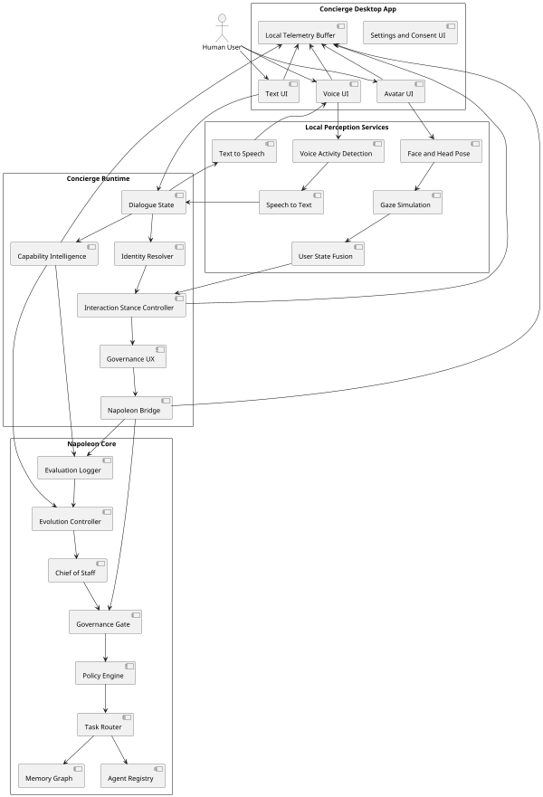
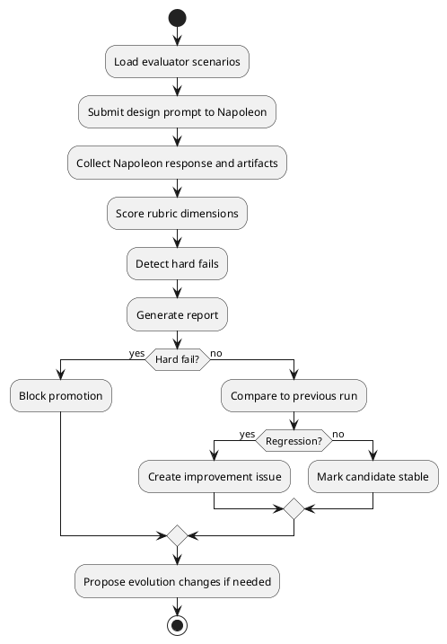
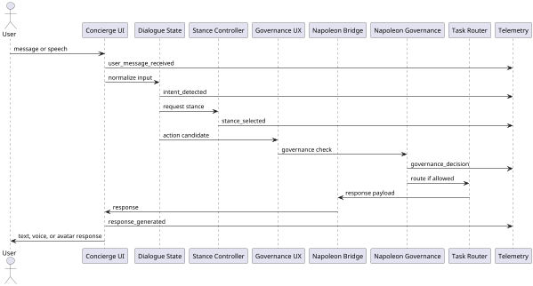
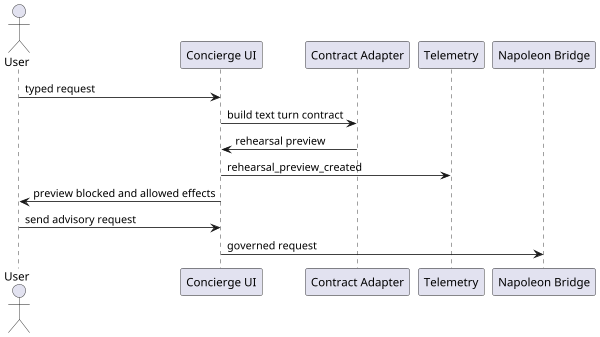
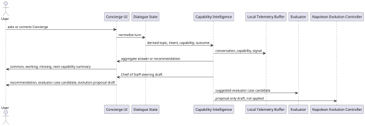
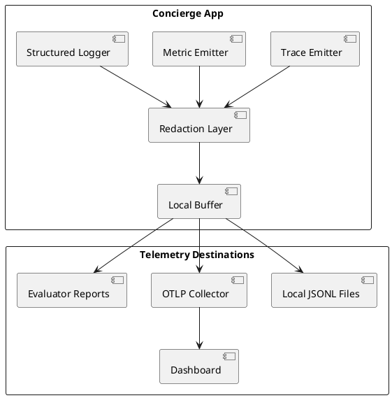

# Architecture

## 1. Recommended architecture

Concierge is a local desktop front-end plus a governed Napoleon bridge.

The front-end owns interaction capture and presentation. Napoleon owns orchestration, governance, memory, and agent delegation.

## 2. System diagram



## 3. Evaluator cycle



## 4. Runtime turn sequence



### Rehearsal Mode sequence

Rehearsal Mode is a local preview step before a live Napoleon bridge call. It builds the same text turn contract shape used by the bridge, then displays the understood request, proposed Napoleon path, Chief of Staff review packet, allowed effects, blocked effects, approval state, memory proposal, trace/audit preview, and evaluator-case candidate. It does not contact Napoleon, capture approval, write memory, send externally, dispatch agents, or execute commands.

Live bridge calls fail closed when the Napoleon endpoint is missing, the Chief of Staff descriptor is missing, descriptor validation fails, descriptor checksum or signature validation fails, authentication fails, the response contract is invalid, local governance is `no_go`, Napoleon returns `deny` or `no_go`, or the bridge times out. This denial rule applies to text turns, memory proposal review handoff, and Chief of Staff steering handoff. Text Concierge can store an optional local bridge bearer token and sends it only as an `Authorization` header, never in request bodies, telemetry, memory proposals, capability exports, or bridge evidence records. The configured Napoleon endpoint is treated as a base URL; text turns resolve to `/v1/concierge/turn`, steering handoff resolves to `/v1/concierge/chief-of-staff/steering`, and memory proposal review handoff resolves to `/v1/concierge/memory-proposals`. The app keeps these paths in a named bridge operation registry generated into `app/src/generatedBridgeOperations.ts` from `api/napoleon_bridge.openapi.yaml`; repository validation reruns `scripts/generate_bridge_operations.py --check`, so local route constants cannot drift silently from the canonical contract. Repository validation also scans Concierge runtime source for direct process execution, memory or graph access, and agent or tool dispatch, so UI code cannot quietly bypass the governed bridge. A successful governed response must include matching governance, trace, and audit provenance from Napoleon and must not carry a denied or no-go governance outcome; Concierge does not synthesize missing trace or audit envelopes for a live success. Live text bridge calls can emit sanitized `bridge_contract_evidence` records for runtime contract comparison. These records contain operation, request kind, path, trace/request/decision/audit IDs, governance outcome, descriptor state, selected agent IDs, effects, and fail-closed reason metadata, but not raw prompt text, response text, endpoint host, or bearer tokens. The local bridge evidence comparator checks captured evidence against the OpenAPI-aligned bridge registry and rejects raw payload or secret fields before records are treated as validation evidence. Early local failures preserve the relevant text-turn, memory proposal, or Chief of Staff steering blocked-effect list, remote failures preserve Napoleon-supplied blocked effects where available, and none of these failures execute side effects, write memory, dispatch agents, send externally, append remote audit records, or capture approval.

Descriptor discovery is treated as connection state, not authority. Text Concierge shows endpoint presence, descriptor discovery, validation, checksum state, signature state, runtime authority, and cache policy before live sends. It also summarizes live bridge readiness from endpoint state, descriptor integrity, in-session sanitized bridge evidence capture/comparison status, last live-send status and fail-closed reason, and blocked effects, while explicitly stating that readiness is not Napoleon approval and does not grant memory writes, agent dispatch, approval capture, or external sends. Captured evidence is compared locally against the named bridge operation registry and rejected if it contains raw or secret fields before the readiness panel marks evidence comparison as passed. The local UI can simulate discovered, missing, and checksum/signature mismatch states, and it can also explicitly fetch `/v1/concierge/chief-of-staff/descriptor` from the configured Napoleon base URL. A fetched descriptor is still only a preflight connection signal; invalid, missing, or mismatched discovery keeps live sends blocked.

When Napoleon returns delegation provenance, Concierge renders a separate Napoleon delegation panel with selected agents, selection reasons, allowed effects, blocked effects, governance state, trace ID, and audit ID. Concierge only attributes statements such as "Passive Brain found..." when the bridge response contains that contribution and the delegation trace/audit IDs match the response envelopes. Concierge only relays statements such as "Napoleon recommends..." when matching recommendation provenance includes the recommended contribution and trace/audit IDs that match the response envelopes. If live response text claims a selected-agent finding or Napoleon recommendation without matching provenance, the bridge fails closed as a contract mismatch. Missing or mismatched provenance is rejected rather than invented.

Reusable local bridge fixtures live in `app/src/napoleonBridgeFixtures.ts`. They cover delegated success, auth failure, contract mismatch, and timeout behavior so bridge handling can be tested without a live Napoleon endpoint while preserving the same fail-closed semantics. Canonical request artifacts live in `examples/sample_memory_proposal_request.json`, `examples/sample_child_memory_proposal_request.json`, `examples/sample_chief_of_staff_steering_request.json`, and `examples/sample_child_chief_of_staff_steering_request.json`; repository validation checks them against the OpenAPI request schemas and verifies that the handoff boundary remains proposal-only, including nested fields that might otherwise imply approval, memory writes, agent dispatch, external sends, or local application. The child memory proposal artifact must remain in child protected mode and require guardian review. The child Chief of Staff steering artifact must remain in child protected mode and include explicit child-safety caution on the recommendation. Canonical response artifacts live in `examples/sample_text_turn_response.json`, `examples/sample_memory_proposal_response.json`, and `examples/sample_chief_of_staff_steering_response.json`; repository validation checks them against the OpenAPI response schemas and verifies that governance, trace, audit, delegation, and recommendation references agree before the artifacts can be treated as local contract evidence. A local HTTP bridge harness lives in `scripts/local_bridge_harness.py`; it serves Napoleon-compatible descriptor, text turn, steering, memory proposal, and evaluator endpoints for smoke validation, but it is not a substitute for a real Napoleon runtime. `make eval-http-local-harness` runs the evaluator in HTTP mode against that local harness to verify transport plumbing while preserving the separate requirement for real Napoleon endpoint validation. Text Concierge settings include a local harness endpoint preset for `http://127.0.0.1:8787`; selecting it only configures the governed endpoint and descriptor preflight, and does not start, stop, or control the harness process or grant authority.



### Conversation Capability Intelligence sequence

Conversation Capability Intelligence records derived metadata about conversation capability performance. It is local-first and proposal-only. It can explain common conversations, working capabilities, missing capabilities, architecture blockers, and recommended next capabilities, but it cannot implement changes, grant approval, write memory, dispatch agents, or send externally.

Chief of Staff steering converts the highest-ranked local capability recommendation into a proposal-only review packet with an evaluator case candidate and evolution proposal draft. The packet remains local unless a governed Napoleon endpoint is configured and descriptor preflight passes. When submitted, Concierge sends an `evolution_proposal_review` request through the governed bridge and requires Napoleon governance, trace, and audit proof before displaying the review response. Remote `deny` or `no_go` outcomes are blocked handoff failures, not successful reviews. Submission does not apply changes locally, write memory, dispatch agents, send externally, or capture approval.

Memory proposal handoff follows the same governed bridge pattern. Concierge may submit a live memory proposal review packet only after endpoint and descriptor preflight pass. The packet contains the proposed memory diff, profile, guardian-review need, blocked effects, trace/audit references, and a proposal-only boundary. Napoleon must return matching governance, trace, and audit proof before Concierge displays the review response. Remote `deny` or `no_go` outcomes are blocked handoff failures, not successful reviews. The handoff is not available from Rehearsal Mode, and it never writes memory, captures approval, dispatches agents, or sends externally from Concierge.



## 5. Observability pipeline



## 6. Component responsibilities

### Concierge Desktop App

- Owns UI, capture permissions, local rendering, and user controls.
- Does not own Napoleon authority.
- Does not silently retain raw camera or microphone data.

### Local Perception Services

- Convert raw local signals into conservative derived signals.
- Emit uncertainty and evidence.
- Avoid durable emotional labels.

### Concierge Runtime

- Maintains dialogue state.
- Resolves user profile.
- Chooses interaction stance.
- Asks for confirmation when governance requires it.
- Tracks derived conversation capability signals and proposal-only improvement recommendations.
- Sends governed requests to Napoleon.

### Napoleon Core

- Owns governance, policy, memory, routing, agent registry, Chief of Staff review, and evolution approval.

## 7. Deployment shape

Initial target:

```text
Concierge.app
  app UI
  local settings
  telemetry buffer

local services
  perception service
  voice service
  avatar service

Napoleon bridge
  local or remote API endpoint
  authenticated
  trace-aware
```

## 8. Security boundaries

1. Camera and microphone are owned by local front-end.
2. Raw capture remains local unless user explicitly records or streams.
3. Napoleon receives derived signals, transcripts, and user-approved context.
4. External actions go through Napoleon governance.
5. Child mode is stricter than adult mode.
